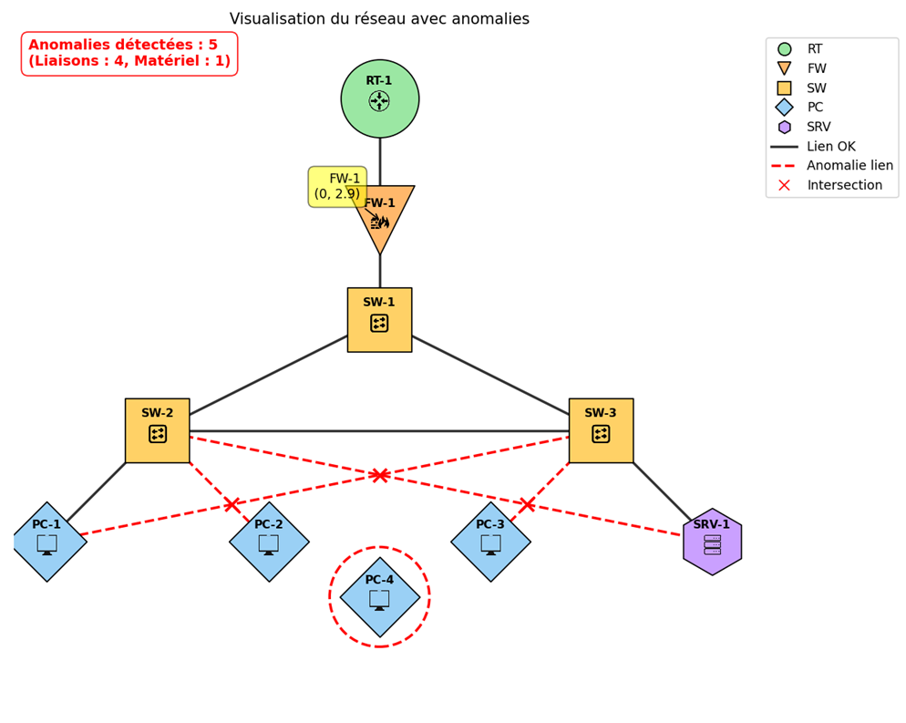

### 1. Introduction et besoins fonctionnels : 

geonetw est un programme python d'environ 200 lignes permettant de schéma une infrastructure réseau complète. 

L'objectif de ce programme est de représenter : 
- représenter un réseau sous forme géométrique
- manipuler des coordonnées et connexions
- détecter des anomalies topologiques (croisement, éléments isolés et non reliés au reste du réseau)
- produire une visualisation graphique 

Exemple de représentation graphique d'un réseau d'entreprise : 



### 2. Librairies utilisées 

geonetw n'utilise que très peu de dépendance. La seule librairie obligatoire est matplotlib étant au coeur du projet. Une autre librairie optionnelle est mplcursors permettant d'avoir de répérer où sont placés les éléments en les survolant. Cela peut être utile pour s'aider à placer les éléments sur le schéma les uns par rapport aux autres. 

### 3. Installation

Pour installer le projet et le lancer une première fois, executer ses commandes votre terminal : 

```
git clone git@github.com:MatDSC/Projet-GeometriePlane.git
cd Projet-GeometriePlane
python3 -m venv .venv
source .venv/bin/activate
pip install -r requirements.txt
python3 main.py
```

### 4. Configuration initiale

#### 4.1 Déclaration des éléments et positions 

Chaque élément réseau à une position (x, y) sur le plan en 2 dimensions. Cette déclaration se fait au niveau de la variable `nodes`. Initialement la configuration pour reproduire le schéma de démonstration est la suivante : 

```
"RT-1": (0, 4),  
"FW-1": (0, 2.9),  
"SW-1": (0, 2),  
"SW-2": (-2, 1),  
"SW-3": (2, 1),  
"PC-1": (-3, 0),  
"PC-2": (-1, 0),  
"PC-3": (1, 0),  
"PC-4": (0, -0.5),  
"SRV-1": (3, 0),
```

Notes : RT = routeur, FW = firewall, SW = switch, PC = PC client, SRV = serveur

Pour déclarer votre schéma : 
```
"ELEMENT_NAME": (x, y)

# Exemple 
"RT-2": (1, 4)
"FW-2": (1, 2.9)
```
#### 4.2 Déclaration des arêtes réseaux 

Chaque élément est relié à un autre élément réseau. Si ce n'est pas le cas, cela déclenche automatiquement la détection d'une anomalie réseau en entourant l'élément d'un cercle rouge en pointillé et en incrémentant le compteur d'anomalie de 1. 

Initialement la configuration est la suivante : 
```
("RT-1", "FW-1"),  
("FW-1", "SW-1"),  
("SW-1", "SW-2"),  
("SW-1", "SW-3"),  
("SW-2", "PC-1"),  
("SW-2", "PC-2"),  
("SW-3", "PC-3"),  
("SW-3", "SRV-1"),  
("SW-2", "SRV-1"),  
("SW-3", "PC-1",),
```

Pour la changer, il suffit de modifier la variable edges : 
```
# Exemple d'ajout 
("SW-3", "SW-2")
```
#### 4.3 Déclaration des couleurs utilisées 

Chaque élément réseau est associé à une couleur. Cette déclaration se fait  au niveau de la variable `PALETTE`. Initialement la configuration est la suivante : 
- routeur : vert
- firewall : orange
- switch : jaune
- PC client : bleu
- serveur : violet 

Pour le changer : 
```
# Nomenclature
"ELEMENT_NAME": "#couleur_hexa"

# Exemple
"RT": "#9be7a3"
```

#### 4.4 Déclaration des formes géométriques utilisées 

Chaque élément réseau est associé à une forme géométrique particulière. Cette déclaration se fait au niveau de la variable `MARKER_BY_TYPE` Initialement, la configuration est la suivante : 
- routeur : disque 
- firewall : triangle
- switch : carré
- PC client : losange
- serveur : hexagone


Pour le changer : 
```
"ELEMENT_NAME": ("lettre_associé_matplotlib_forme", taille)

# Exemple avec le code : un routeur est associé à un disque (cercle) de taille 3800 
"RT": ("o", 3800)
```

La documentation des `markers` de matplotlib est disponible à cette adresse : https://matplotlib.org/stable/api/markers_api.html 
#### 4.5 Déclaration des icones utilisés 

Chaque élément réseau, en plus d'une forme géométrique associé est associé à un icone pour permettre une identification visuelle plus rapide. Cette déclaration se fait au niveau de la variable `IMG_PATH` sous la forme suivante : 

```
# Nomenclature
"ELEMENT_NAME": "./path/to/img"

# Configuraiton initiale
"RT": "./images/router.png",  
"FW": "./images/firewall.png",  
"SW": "./images/switch.png",  
"PC": "./images/computer.png",  
"SRV": "./images/server.png",
```

### 5. Sauvegarde de la configuration réseau 

La configuration du schéma réseau créé est sauvergardé `./var/schema/` 
Le nom par défaut est `network_visualization.png`

Vous pouvez changer l'emplacement et le nom du fichier en modifiant la variable `filename` au début du fichier, après l'import des modules / librairies python.